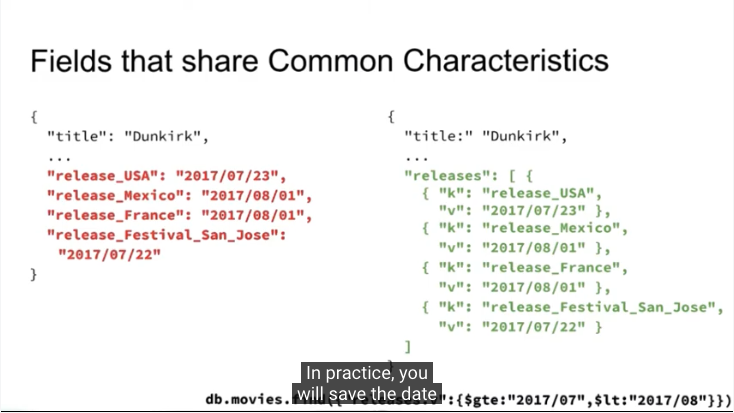

# Mongo DB

## Pattern

패턴은 데이터 모델을 최대한 활용하는 방법.
주요 목표: 주어진 사용 사례, 혹은 액세스 패턴에 맞춰 스키마를 최적화 하는 것

각 패턴은 아래를 야기할 수 있습니다:

1. 문서 간의 데이터 중복
2. 일부 데이터의 부실
3. 참조 무결성을 보장하는 애플리케이션 측 추가 로직 작성

### Duplication

데이터를 복제하고 지속적으로 업데이트 해야하는 경우, 대량 업데이트로 중복을 해결할 것.

중복이 중복하지 않는 경우보다 나은 경우:

- 주문 내의 주소 정보. 주문 시의 주소는 바뀌지 않아야 한다.
- 복사 데이터가 변경되지 않는 경우. 영화 개봉 후엔 배우의 목록이 변경되지 않는다.

중복하지 않는 것이 나은 경우:

- 계산이 필요한 데이터? 영화 하나가 있고, 각 스크린 별 매출을 기록한 데이터가 있을 때, 매출의 총 합계를 영화 컬렉션에 반영하는 것은 좋지 않은 선택. 데이터가 중복되며, 이를 적용할 경우 참조 무결성을 유지해야 할 필요가 있음.

### Staleness(Not new data)

- 얼마동안, 사용자가 최신 값을 보지 못하는 것을 용인할 수 있는지?
  분석 쿼리는 세컨더리 노드에서 실행됨. 오래된 데이터가 있을 수 있다.
- 모든 데이터에는 임계값(threshold)이 존재한다.

해결하는 방법

- 배치 업데이트.
- 스트림 변경을 사용하여 변경을 찾는다.

[Change Streams] (https://docs.mongodb.com/manual/changeStreams/)
데이터의 변화를 관찰할 수 있음.
a single collection, a database, or an entire deployment(전체 배포)

### 참조 무결성 (Referential Integrity)

왜 발생하는가?
어떤 데이터를 삭제한 결과일 수 있다.
MongoDB는 cascading update, delete를 지원하지 않기 때문.
애플리케이션 자체에서 참조 무결성을 유지할 책임이 있다.

- 지연된 참조 무결성의 경우, Change Streams에 의존할 수 있음.
- 단일 문서 유지(참조 자체를 사용하지 않는다)
- 다중 문서 트랜잭션 사용

### 속성 패턴 (Attribute Pattern)

해결하고자 하는 것

- 수많은 유사한 필드
- 한번에 많은 필드를 검색하고 싶음
- 필드는 문서의 오직 작은 subset을 나타낸다.

1. 근본이 되는 Schema를 정의하고, 추가되는 속성들은 "add specs" 속성의 배열로 관리한다. 그 배열의 형태는 {"k":"", "v":""}
2. 값의 내용이 비슷한 속성들은 또다시 배열로 묶을 수 있다. 예를 들어, 개봉일의 경우, 각 나라마다 개봉일이 다를 것인데, 전부 따로 key:value를 할당할 것이 아니라, releases 속성의 배열로 관리할 수 있다.
   

사용 예

- 제품의 특성
- 같은 값을 가지고 있는 필드를 설정할 때

장점

- 쉬운 인덱싱.
- key 이름을 미리 알 필요가 없다.
- 기존 key:value에 더해 추가 구성을 할 수 있다.
